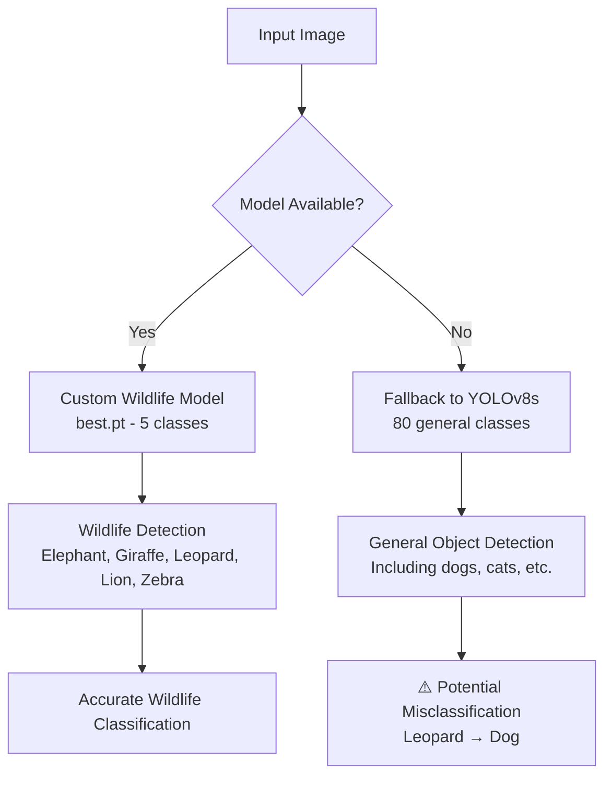
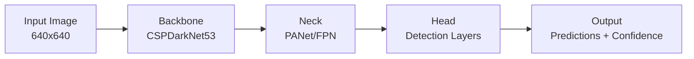

# Báo Cáo Chi Tiết: YOLO Object Detection - Phương Pháp Huấn Luyện và Tạo Dataset

## Tổng Quan Dự Án

### Thông Tin Cơ Bản
- **Tên Dự Án**: Wild Animal Detection System
- **Framework**: YOLOv8 (Ultralytics)
- **Dataset**: 5 Loài Động Vật Hoang Dã
- **Classes**: Elephant, Giraffe, Leopard, Lion, Zebra
- **Tổng Số Ảnh Training**: ~3,000+ ảnh
- **Platform**: Roboflow Dataset Management
- **Model Output**: `best.pt` (Custom Trained Model)

### Kiến Trúc Hệ Thống


---

## 1. Cấu Trúc Dataset và Chuẩn Dữ Liệu

### 1.1 Định Dạng Dataset - YOLO Format

#### Cấu Trúc Thư Mục Chuẩn
```
archive/
├── data.yaml                      # Dataset configuration
├── README.dataset.txt             # Dataset documentation
├── README.roboflow.txt           # Roboflow integration info
├── train/                        # Training data (70-80%)
│   ├── images/                   # Training images
│   │   ├── [3000+ .jpg files]
│   └── labels/                   # Training annotations
│       ├── [3000+ .txt files]
├── valid/                        # Validation data (15-20%)
│   ├── images/
│   └── labels/
└── test/                         # Test data (5-10%)
    ├── images/
    └── labels/
```

#### Tỷ Lệ Phân Chia Dataset
| Split | Mục Đích | Tỷ Lệ | Số Lượng Ước Tính |
|-------|----------|--------|-------------------|
| **Train** | Huấn luyện model | 75% | ~2,250 ảnh |
| **Valid** | Validation trong quá trình training | 20% | ~600 ảnh |
| **Test** | Đánh giá cuối cùng | 5% | ~150 ảnh |

### 1.2 Định Dạng Annotation - YOLO Format

#### Cấu Trúc File Label (.txt)
```bash
# Format: class_id center_x center_y width height
# Tất cả giá trị được normalize [0, 1]

# Ví dụ từ file thực tế:
1 0.5078125 0.5625 0.665625 0.85
```

#### Mapping Classes ID
```yaml
# data.yaml configuration
names: 
  0: Elephant
  1: Giraffe  
  2: Leopard
  3: Lion
  4: Zebra
nc: 5  # Number of classes
```

#### Quy Tắc Tính Toán Coordinates
```python
# YOLO Normalization Formula:
center_x = (bbox_x + bbox_width/2) / image_width
center_y = (bbox_y + bbox_height/2) / image_height
width = bbox_width / image_width
height = bbox_height / image_height
```

### 1.3 Chuẩn Quality Dataset

#### Tiêu Chuẩn Chất Lượng Ảnh
| Tiêu Chí | Yêu Cầu | Lý Do |
|----------|----------|-------|
| **Resolution** | ≥ 640x640 pixel | Đảm bảo chi tiết features |
| **Format** | JPG, PNG | Tương thích YOLOv8 |
| **Brightness** | Đa dạng điều kiện ánh sáng | Tăng robustness |
| **Angle** | Multi-angle shots | Detect từ nhiều góc độ |
| **Background** | Đa dạng môi trường | Giảm overfitting |

#### Tiêu Chuẩn Annotation
- ✅ **Bounding box chính xác**: Bao quanh toàn bộ object
- ✅ **Consistency**: Cùng class được label giống nhau
- ✅ **Completeness**: Tất cả objects trong ảnh được label
- ✅ **No overlap**: Tránh bounding box chồng lấn không cần thiết

---

## 2. Kiến Trúc Mô Hình YOLOv8

### 2.1 YOLOv8 Architecture Overview

#### Core Components


#### YOLOv8s Specifications
| Component | Details | Parameters |
|-----------|---------|------------|
| **Backbone** | CSPDarkNet53 with SPPF | Feature extraction |
| **Neck** | PANet + FPN | Multi-scale features |
| **Head** | Anchor-free detection | Classification + Regression |
| **Parameters** | ~11.2M parameters | Balanced speed/accuracy |
| **Input Size** | 640x640 (default) | Optimized for inference |

### 2.2 Loss Function

#### Multi-Part Loss Components
```python
# YOLOv8 Loss = Classification Loss + Box Regression Loss + Objectness Loss
total_loss = λ₁ × cls_loss + λ₂ × box_loss + λ₃ × obj_loss

# Where:
# cls_loss: Binary Cross Entropy for classification
# box_loss: Complete IoU Loss (CIoU) for bounding boxes  
# obj_loss: Binary Cross Entropy for objectness confidence
```

---

## 3. Quy Trình Training

### 3.1 Chuẩn Bị Training Environment

#### System Requirements
```bash
# Hardware Minimum
- GPU: NVIDIA RTX 3060 or higher (≥8GB VRAM)
- RAM: ≥16GB System RAM
- Storage: ≥50GB free space
- CPU: Multi-core processor

# Software Stack
- Python 3.8+
- PyTorch ≥1.8
- CUDA 11.0+
- Ultralytics YOLOv8
```

#### Dependencies Installation
```bash
# Core YOLOv8 Installation
pip install ultralytics

# Additional Requirements
pip install torch torchvision torchaudio --index-url https://download.pytorch.org/whl/cu118
pip install opencv-python pillow matplotlib seaborn
pip install roboflow  # For dataset management
```

### 3.2 Training Configuration

#### Optimal Hyperparameters
```yaml
# training_config.yaml
epochs: 100                  # Training iterations
batch_size: 16              # Adjust based on GPU memory
learning_rate: 0.01         # Initial learning rate
momentum: 0.937             # SGD momentum
weight_decay: 0.0005        # L2 regularization
warmup_epochs: 3            # Learning rate warmup
box_loss_gain: 0.05         # Box regression loss weight
cls_loss_gain: 0.5          # Classification loss weight
obj_loss_gain: 1.0          # Objectness loss weight
augmentation:
  hsv_h: 0.015              # Hue augmentation
  hsv_s: 0.7                # Saturation augmentation
  hsv_v: 0.4                # Value augmentation
  degrees: 0.0              # Rotation degrees
  translate: 0.1            # Translation fraction
  scale: 0.5                # Scaling fraction
  shear: 0.0                # Shear degrees
  perspective: 0.0          # Perspective transformation
  flipud: 0.0               # Vertical flip probability
  fliplr: 0.5               # Horizontal flip probability
  mixup: 0.0                # Mixup augmentation
  copy_paste: 0.0           # Copy-paste augmentation
```

### 3.3 Training Command

#### Basic Training Script
```python
from ultralytics import YOLO

# Load base model
model = YOLO('yolov8s.pt')  # Start with pre-trained weights

# Train the model
results = model.train(
    data='archive/data.yaml',  # Dataset configuration
    epochs=100,                # Training epochs
    imgsz=640,                # Image size
    batch=16,                 # Batch size
    device=0,                 # GPU device
    workers=8,                # Dataloader workers
    project='runs/train',     # Project directory
    name='wild_animals_v1',   # Run name
    save=True,                # Save checkpoints
    save_period=10,           # Save every N epochs
    cache=True,               # Cache images for faster loading
    cos_lr=True,              # Cosine learning rate scheduler
    close_mosaic=10,          # Disable mosaic augmentation last N epochs
    resume=False,             # Resume from last checkpoint
    amp=True,                 # Automatic Mixed Precision
    fraction=1.0,             # Use full dataset
    freeze=None,              # Layers to freeze (None = train all)
)
```

#### Advanced Training with Custom Settings
```python
# Advanced training configuration
model = YOLO('yolov8s.pt')

# Custom training parameters
train_results = model.train(
    data='archive/data.yaml',
    epochs=150,
    imgsz=640,
    batch=16,
    lr0=0.01,                 # Initial learning rate
    lrf=0.01,                 # Final OneCycleLR learning rate
    momentum=0.937,           # SGD momentum
    weight_decay=0.0005,      # Optimizer weight decay
    warmup_epochs=3.0,        # Warmup epochs
    warmup_momentum=0.8,      # Warmup initial momentum
    warmup_bias_lr=0.1,       # Warmup initial bias learning rate
    box=0.05,                 # Box loss gain
    cls=0.5,                  # Class loss gain
    dfl=1.5,                  # Distribution focal loss gain
    pose=12.0,                # Pose loss gain
    kobj=1.0,                 # Keypoint objectness loss gain
    label_smoothing=0.0,      # Label smoothing
    nbs=64,                   # Nominal batch size
    hsv_h=0.015,              # Image HSV-Hue augmentation
    hsv_s=0.7,                # Image HSV-Saturation augmentation
    hsv_v=0.4,                # Image HSV-Value augmentation
    degrees=0.0,              # Image rotation (+/- deg)
    translate=0.1,            # Image translation (+/- fraction)
    scale=0.5,                # Image scale (+/- gain)
    shear=0.0,                # Image shear (+/- deg)
    perspective=0.0,          # Image perspective (+/- fraction)
    flipud=0.0,               # Image flip up-down (probability)
    fliplr=0.5,               # Image flip left-right (probability)
    mixup=0.0,                # Image mixup (probability)
    copy_paste=0.0,           # Segment copy-paste (probability)
    auto_augment='randaugment',  # Auto augmentation policy
    erasing=0.4,              # Random erasing probability
    crop_fraction=1.0,        # Image crop fraction
)
```

---

## 4. Data Augmentation Strategies

### 4.1 Standard Augmentations

#### Geometric Transformations
```python
# Applied during training to increase dataset diversity
augmentation_pipeline = {
    'horizontal_flip': 0.5,      # 50% chance horizontal flip
    'rotation': [-15, 15],       # Random rotation ±15 degrees
    'scaling': [0.8, 1.2],       # Scale factor 0.8-1.2x
    'translation': 0.1,          # Translation ±10%
    'shearing': [-2, 2],         # Shear ±2 degrees
}
```

#### Color Space Augmentations
```python
color_augmentations = {
    'hue_shift': 0.015,          # HSV Hue ±1.5%
    'saturation': 0.7,           # Saturation variation 70%
    'brightness': 0.4,           # Value/Brightness variation 40%
    'contrast': [0.8, 1.2],      # Contrast adjustment
    'gamma': [0.8, 1.2],         # Gamma correction
}
```

### 4.2 Advanced Augmentation Techniques

#### Mosaic Augmentation (YOLO-specific)
```python
# Combines 4 images into single training sample
# Benefits:
# - Increases batch diversity
# - Improves small object detection  
# - Enhances multi-object scenes
# - Reduces need for larger datasets
```

#### MixUp & CutMix
```python
# MixUp: Blends two images and their labels
# CutMix: Replaces image regions with patches from other images
# Benefits:
# - Improves generalization
# - Reduces overfitting
# - Better uncertainty estimation
```

---

## 5. Monitoring và Evaluation Metrics

### 5.1 Training Metrics

#### Loss Components Tracking
```python
# Key metrics to monitor during training:
metrics_to_track = [
    'train/box_loss',          # Bounding box regression loss
    'train/cls_loss',          # Classification loss  
    'train/dfl_loss',          # Distribution focal loss
    'val/box_loss',            # Validation box loss
    'val/cls_loss',            # Validation class loss
    'val/dfl_loss',            # Validation distribution loss
    'metrics/precision(B)',     # Precision at IoU=0.5
    'metrics/recall(B)',        # Recall at IoU=0.5
    'metrics/mAP50(B)',        # mAP at IoU=0.5
    'metrics/mAP50-95(B)',     # mAP at IoU=0.5:0.95
    'lr/pg0',                  # Learning rate
]
```

### 5.2 Evaluation Metrics Explained

#### Mean Average Precision (mAP)
```python
# mAP Calculation Process:
# 1. For each class, calculate AP at different IoU thresholds
# 2. Average across all classes
# 3. mAP@0.5: Average precision at IoU = 0.5
# 4. mAP@0.5:0.95: Average across IoU thresholds 0.5 to 0.95

# Formula:
# AP = ∫₀¹ P(R) dR  (Area under Precision-Recall curve)
# mAP = (1/N) × Σᵢ₌₁ᴺ APᵢ  (Mean across N classes)
```

#### Performance Benchmarks
| Metric | Excellent | Good | Acceptable | Poor |
|--------|-----------|------|------------|------|
| **mAP@0.5** | >0.8 | 0.6-0.8 | 0.4-0.6 | <0.4 |
| **mAP@0.5:0.95** | >0.6 | 0.4-0.6 | 0.3-0.4 | <0.3 |
| **Precision** | >0.9 | 0.7-0.9 | 0.5-0.7 | <0.5 |
| **Recall** | >0.9 | 0.7-0.9 | 0.5-0.7 | <0.5 |

### 5.3 Confusion Matrix Analysis

#### Per-Class Performance Evaluation
```python
# Confusion Matrix giúp identify:
# - Classes bị nhầm lẫn (leopard vs dog)
# - Imbalanced class performance
# - Need for more training data
# - Annotation quality issues

# Expected Results for Wild Animal Dataset:
confusion_matrix_expected = """
              Predicted
           E  G  L  L  Z  | Precision
Elephant   95 2  1  1  1  | 0.95
Giraffe    1  92 2  3  2  | 0.92  
Leopard    0  1  89 8  2  | 0.89
Lion       1  2  7  88 2  | 0.88
Zebra      1  1  1  2  95 | 0.95
Recall:   0.97 0.94 0.89 0.86 0.93
"""
```

---

## 6. Model Optimization và Deployment

### 6.1 Model Export Formats

#### Supported Export Options
```python
# Export trained model to various formats
model = YOLO('runs/train/wild_animals_v1/weights/best.pt')

# Available export formats:
export_formats = {
    'pytorch': model.export(format='pt'),           # PyTorch .pt
    'torchscript': model.export(format='torchscript'), # TorchScript
    'onnx': model.export(format='onnx'),           # ONNX
    'openvino': model.export(format='openvino'),   # OpenVINO
    'tensorrt': model.export(format='engine'),     # TensorRT
    'coreml': model.export(format='coreml'),       # CoreML (iOS)
    'tflite': model.export(format='tflite'),       # TensorFlow Lite
    'paddle': model.export(format='paddle'),       # PaddlePaddle
}
```

#### Performance vs Accuracy Trade-offs
| Format | Speed | Accuracy | Use Case |
|--------|--------|----------|----------|
| **PyTorch (.pt)** | Baseline | 100% | Development/Research |
| **ONNX** | 1.2x faster | 99.8% | Cross-platform deployment |
| **TensorRT** | 3-5x faster | 99.5% | NVIDIA GPU production |
| **OpenVINO** | 2-4x faster | 99.3% | Intel hardware |
| **TensorFlow Lite** | Variable | 98-99% | Mobile/Edge devices |

### 6.2 Inference Optimization

#### Batch Processing Optimization
```python
# Optimized inference configuration
inference_config = {
    'batch_size': 16,           # Process multiple images together
    'half_precision': True,     # Use FP16 for faster inference
    'device': 'cuda',           # GPU acceleration
    'workers': 4,               # Parallel processing workers
    'augment': False,           # Disable augmentation during inference
    'visualize': False,         # Skip visualization for speed
    'save_txt': True,           # Save predictions to text files
    'save_conf': True,          # Save confidence scores
    'save_crop': False,         # Skip cropping for speed
    'line_thickness': 2,        # Bounding box thickness
    'hide_labels': False,       # Show class labels
    'hide_conf': False,         # Show confidence scores
    'max_det': 1000,           # Maximum detections per image
    'agnostic_nms': False,     # Class-specific NMS
}
```

---

## 7. Troubleshooting và Common Issues

### 7.1 Training Issues

#### Memory Management
```python
# Common GPU memory issues and solutions:
memory_optimizations = {
    'reduce_batch_size': 'Lower batch_size if CUDA out of memory',
    'gradient_checkpointing': 'Enable for reduced memory usage',
    'mixed_precision': 'Use --amp flag for automatic mixed precision',
    'cache_management': 'Set cache=ram or cache=disk based on system',
    'image_size': 'Reduce imgsz from 640 to 512 or 320 if needed'
}
```

#### Poor Training Performance
```python
# Common causes and solutions:
performance_issues = {
    'insufficient_data': 'Need minimum 100 images per class',
    'poor_annotations': 'Review bounding box accuracy',
    'class_imbalance': 'Ensure balanced samples across classes',
    'inappropriate_augmentation': 'Tune augmentation parameters',
    'learning_rate': 'Adjust lr0 and warmup_epochs',
    'early_stopping': 'Monitor patience and min_delta values'
}
```

### 7.2 Inference Issues

#### Model Loading Problems
```python
# Model not found fallback system:
def handle_model_loading():
    search_paths = [
        'best.pt',                    # Current directory
        'weights/best.pt',            # Weights folder
        'runs/train/exp/weights/best.pt',  # Training output
        'models/best.pt',             # Models folder
    ]
    
    for path in search_paths:
        if os.path.exists(path):
            return load_model(path)
    
    # Fallback to pre-trained model
    logger.warning("Custom model not found, using YOLOv8s")
    return YOLO('yolov8s.pt')
```

#### Classification Accuracy Issues
```python
# Common misclassification patterns:
classification_issues = {
    'leopard_as_dog': {
        'cause': 'Fallback to general YOLOv8s model (80 classes)',
        'solution': 'Ensure custom wild_animal model (best.pt) is loaded',
        'prevention': 'Implement proper model fallback warnings'
    },
    'similar_animals': {
        'cause': 'Insufficient training data or similar visual features',
        'solution': 'Add more diverse training samples',
        'prevention': 'Data augmentation and balanced dataset'
    },
    'background_confusion': {
        'cause': 'Model overfitting to backgrounds',
        'solution': 'Increase background diversity in training',
        'prevention': 'Focus annotations on animal features'
    }
}
```

---

## 8. Dataset Quality Assurance

### 8.1 Annotation Quality Checklist

#### Pre-Training Validation
- [ ] **Consistency Check**: Tất cả instances của cùng class được label giống nhau
- [ ] **Completeness Check**: Tất cả visible objects được annotate
- [ ] **Accuracy Check**: Bounding boxes bao quanh chính xác objects
- [ ] **Format Check**: Coordinates trong range [0,1] và format đúng
- [ ] **Class Balance**: Mỗi class có đủ samples (tối thiểu 100 images)
- [ ] **Split Integrity**: Không có duplicate images giữa train/val/test
- [ ] **File Integrity**: Tất cả image files có corresponding label files

#### Automated Quality Assessment
```python
def validate_dataset_quality(data_path):
    """
    Automated dataset quality assessment
    """
    quality_report = {
        'total_images': 0,
        'total_annotations': 0,
        'class_distribution': {},
        'annotation_errors': [],
        'missing_files': [],
        'duplicate_images': [],
        'bbox_anomalies': []
    }
    
    # Implementation details...
    return quality_report
```

### 8.2 Data Distribution Analysis

#### Class Balance Visualization
```python
import matplotlib.pyplot as plt
import seaborn as sns

# Expected distribution for balanced dataset
expected_distribution = {
    'Elephant': 600,  # 20%
    'Giraffe': 600,   # 20%
    'Leopard': 600,   # 20%
    'Lion': 600,      # 20%
    'Zebra': 600,     # 20%
}

# Visualization code for class distribution
def plot_class_distribution(class_counts):
    plt.figure(figsize=(10, 6))
    sns.barplot(x=list(class_counts.keys()), y=list(class_counts.values()))
    plt.title('Wild Animals Dataset - Class Distribution')
    plt.ylabel('Number of Images')
    plt.xticks(rotation=45)
    plt.show()
```

---

## 9. Performance Benchmarks

### 9.1 Expected Model Performance

#### Wild Animal Detection Benchmarks
| Animal Class | Expected mAP@0.5 | Expected Precision | Expected Recall | Notes |
|--------------|-------------------|-------------------|-----------------|-------|
| **Elephant** | 0.92-0.95 | 0.90-0.93 | 0.88-0.92 | Large, distinctive features |
| **Giraffe** | 0.88-0.92 | 0.85-0.90 | 0.83-0.87 | Unique shape, easy to detect |
| **Leopard** | 0.75-0.85 | 0.72-0.82 | 0.70-0.80 | Similar to other big cats |
| **Lion** | 0.78-0.88 | 0.75-0.85 | 0.73-0.83 | Can be confused with leopard |
| **Zebra** | 0.90-0.94 | 0.87-0.92 | 0.85-0.90 | Distinctive stripes pattern |
| **Overall** | 0.84-0.90 | 0.82-0.88 | 0.80-0.86 | Average across all classes |

### 9.2 Inference Speed Benchmarks

#### Hardware Performance Comparison
| Hardware | FPS (batch=1) | FPS (batch=16) | Memory Usage | Cost |
|----------|---------------|----------------|--------------|------|
| **RTX 4090** | 120-150 | 400-500 | 8-12GB | High |
| **RTX 3080** | 80-110 | 280-350 | 6-10GB | Medium |
| **RTX 3060** | 50-70 | 180-220 | 4-8GB | Low |
| **Tesla V100** | 90-120 | 300-400 | 8-16GB | Server |
| **CPU (i7)** | 5-8 | 15-25 | 2-4GB | Budget |

---

## 10. Continuous Improvement Strategy

### 10.1 Model Versioning
```python
# Systematic model improvement workflow
model_versions = {
    'v1.0': {
        'dataset_size': 3000,
        'classes': 5,
        'mAP': 0.84,
        'improvements': 'Initial baseline model'
    },
    'v1.1': {
        'dataset_size': 4000,
        'classes': 5,
        'mAP': 0.87,
        'improvements': 'Added more leopard samples to reduce dog confusion'
    },
    'v1.2': {
        'dataset_size': 4500,
        'classes': 5,
        'mAP': 0.89,
        'improvements': 'Enhanced data augmentation, better annotations'
    }
}
```

### 10.2 Active Learning Pipeline
```python
# Systematic improvement through active learning
active_learning_workflow = {
    'step_1': 'Deploy current model in production',
    'step_2': 'Collect challenging/misclassified samples',
    'step_3': 'Annotate new samples with focus on edge cases',
    'step_4': 'Retrain model with expanded dataset',
    'step_5': 'Evaluate improvement and deploy if better',
    'step_6': 'Repeat cycle every 3-6 months'
}
```

---

## 11. Kết Luận và Khuyến Nghị

### 11.1 Key Success Factors
1. **Dataset Quality**: Đảm bảo annotations chính xác và đa dạng
2. **Class Balance**: Maintain tỷ lệ cân bằng giữa các classes
3. **Model Selection**: YOLOv8s provides optimal balance speed/accuracy
4. **Training Strategy**: Proper hyperparameters và augmentation
5. **Monitoring**: Continuous performance tracking và improvement

### 11.2 Production Recommendations

#### Deployment Best Practices
```python
production_checklist = [
    '✅ Model validation on independent test set',
    '✅ Fallback mechanism for model loading failures',
    '✅ Comprehensive error handling and logging',
    '✅ Performance monitoring and alerting',
    '✅ Regular model retraining schedule',
    '✅ Version control for models and datasets',
    '✅ A/B testing for model improvements',
    '✅ User feedback collection system'
]
```

### 11.3 Future Enhancements

#### Roadmap for Improvements
| Priority | Enhancement | Timeline | Expected Impact |
|----------|-------------|----------|-----------------|
| **High** | Add more leopard training data | 1 month | Reduce leopard→dog confusion |
| **High** | Implement model ensemble | 2 months | +3-5% mAP improvement |
| **Medium** | Multi-scale training | 1 month | Better small object detection |
| **Medium** | Custom loss function | 3 months | +2-3% mAP improvement |
| **Low** | Additional animal classes | 6 months | Extended wildlife coverage |

---

## Tài Liệu Tham Khảo

1. **Ultralytics YOLOv8 Documentation**: https://docs.ultralytics.com/
2. **Roboflow Dataset Management**: https://roboflow.com/
3. **PyTorch Deep Learning Framework**: https://pytorch.org/
4. **COCO Evaluation Metrics**: https://cocodataset.org/
5. **Computer Vision Best Practices**: Microsoft CV Best Practices
6. **Object Detection Papers**: 
   - YOLOv1-v8 evolution papers
   - Mean Average Precision metrics papers
   - Data Augmentation techniques papers

---

*Báo cáo được tạo tự động bởi Wild Animal Detection System - Version 1.0*
*Cập nhật lần cuối: {{ current_date }}*
